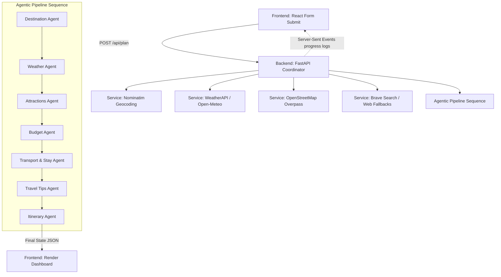

# TripPlanner.AI

An AI-powered multi-agent travel coordinator with a Python FastAPI backend and a React + Vite frontend. It automates destination research, weather analysis, attraction selection, budget estimation, safety-oriented lodging recommendations, transport planning, and daily itinerary assembly.

---

## 🌟 What It Does

1. **User Preferences Intake**: Collects destination, trip duration, budget tier, travel style, interests, and special constraints.
2. **Location Geocoding**: Resolves location coordinates (latitude and longitude) using **Nominatim** (with LLM fallback).
3. **Data Fetching**:
   - Downloads 7-day weather forecast data from **WeatherAPI** or **Open-Meteo**.
   - Pulls nearby points of interest (POIs) from **OpenStreetMap (OSM) Overpass API**.
   - Queries **Brave Search** (or free Wikipedia/DuckDuckGo fallback) for real-time destination context and guidelines.
4. **Multi-Agent Execution**: Sequences specialist Gemini/OpenAI-powered agents to design every facet of the trip.
5. **SSE Streaming**: Streams progress logs, intermediate agent states, and performance metrics in real-time to the frontend.
6. **Interactive Dashboard**: Displays tabs for Overview, Attractions, Day-by-Day Itinerary, Lodging & Transit, Budget, Weather, Travel Tips, and an Export panel.

---

## 🏗️ System Architecture & Workflow

TripPlanner.AI runs as a sequential, multi-agent pipeline orchestrated by a central coordinator.



### Specialist Agents
- **Coordinator**: Resolves coordinates, fetches external APIs, passes state data, and handles fail-safes/fallbacks.
- **Destination Agent**: Researches history, cultural context, geography, and optimal travel seasons.
- **Weather Agent**: Evaluates temperature/precipitations to output clothing checklists and activity adjustments.
- **Attractions Agent**: Selects and filters the best local landmarks matching interests (mixing LLM knowledge and live OSM nodes).
- **Budget Agent**: Projects expenses (Accommodation, Food, Transport, Activities, Buffer) and outputs money-saving tips.
- **Transport & Stay Agent**: Curates neighborhood safety descriptions, hotel list with safety features/pricing, and transit routes.
- **Travel Tips Agent**: Handles custom packing needs, local etiquette, and emergency precautions.
- **Itinerary Agent**: Pulls all prior agent outputs to compile a master morning-afternoon-evening calendar.

---

## 🛠️ Third-Party Service Integrations & API Fallbacks

The backend services are designed for zero-config resilience:

| Feature / Service | Primary Provider | Fallback Option | API Key Required? |
| :--- | :--- | :--- | :--- |
| **LLM Reasoning** | Google Gemini (`gemini-3.5-flash`) | OpenAI (`gpt-4o-mini`) | Yes (Gemini or OpenAI key) |
| **Geocoding** | Nominatim (OSM) | LLM Geocoding | Optional (None needed for basic use) |
| **Weather Forecast** | WeatherAPI.com | Open-Meteo API | Optional (WeatherAPI requires key) |
| **Web Search** | Brave Search API | DuckDuckGo Scraping + Wikipedia | Optional (Brave requires key) |
| **Points of Interest**| OpenStreetMap Overpass API | None (Empty array fallback) | No |

---

## 📦 Project Directory Structure

```text
tripPlanner/
├── backend/
│   ├── main.py                  # FastAPI app entry point & CORS configuration
│   ├── coordinator.py           # Core agent pipeline orchestration
│   ├── agents/
│   │   ├── __init__.py
│   │   ├── coordinator.py       # Helper for agent actions
│   │   ├── prompts.py           # System & user templates for LLM agents
│   │   ├── state.py             # Pydantic models outlining the schema
│   │   └── transport_stay.py    # Custom sub-agent logic for hotel and transit
│   └── services/
│       ├── __init__.py
│       ├── brave.py             # Brave Web Search & DuckDuckGo/Wikipedia scrapers
│       ├── gemini.py            # Gemini JSON caller with 429 rate limit backoff
│       ├── nominatim.py         # OSM Geocoding integration
│       ├── openai.py            # OpenAI JSON completions client
│       ├── overpass.py          # OpenStreetMap Overpass POI service
│       └── weather.py           # WeatherAPI & Open-Meteo integration
│
├── frontend/
│   ├── src/
│   │   ├── components/
│   │   │   ├── APIConfig.jsx    # Collapsible drawer for API keys & LLM selection
│   │   │   ├── AgentProgress.jsx# Real-time agent status tracker and log console
│   │   │   ├── TripDashboard.jsx# Multi-tab trip details renderer
│   │   │   └── TripForm.jsx     # Form inputs for destination, duration, budget, etc.
│   │   ├── styles/
│   │   │   ├── dashboard.css
│   │   │   ├── form.css
│   │   │   ├── main.css
│   │   │   └── progress.css
│   │   ├── App.jsx              # Main UI coordinator and SSE connection logic
│   │   ├── App.css
│   │   ├── main.jsx             # React startup wrapper
│   │   └── index.css
│   ├── vite.config.js           # Proxy configuration mapping `/api` to port 8000
│   └── package.json
│
├── package.json                 # Root boilerplate package.json
└── vite.config.js               # Root boilerplate Vite configuration
```

---

## 📊 Data Architecture (`TripState`)

All data between the backend agents and the frontend dashboard is synchronized via a centralized `TripState` schema defined with Pydantic in [state.py](backend/agents/state.py):

*   **`user_inputs`**: User selections (`destination`, `duration`, `budget_tier`, `travel_style`, `interests`, `constraints`).
*   **`resolved_location`**: Coordinates (`lat`, `lon`) and full `display_name`.
*   **`weather_forecast`**: Daily records containing max/min temperatures, code, and condition strings.
*   **`osm_attractions`**: Nearby attraction list resolved from OpenStreetMap.
*   **`destination_details`**: General overview, cultural highlights, geographical details, and best time to visit.
*   **`weather_report`**: Short summary, packing clothing list, and outdoor activity recommendations.
*   **`selected_attractions`**: Curated landmarks with estimated time, descriptions, categories, and estimated costs.
*   **`budget_breakdown`**: Detailed budget segments, daily average rate, allocations, and saving tips.
*   **`transport_stay_details`**: Lodging recommendations (price, safety score, amenities), neighborhood guides, transit lists, and security tips.
*   **`travel_tips`**: Packing checklist, safety precautions, and cultural etiquette recommendations.
*   **`itinerary`**: Sequential day-by-day array including morning, afternoon, and evening tasks, pricing, transit modes, overnight stay, and daily notes.

---

## 🚀 Setup and Local Running

### Prerequisites
- **Python 3.10+**
- **Bun** (Node.js runtime/package manager)
- **API Keys**:
  - A **Google Gemini API Key** (from [Google AI Studio](https://aistudio.google.com/)) or an **OpenAI API Key** (from [OpenAI Platform](https://platform.openai.com/)).
  - *(Optional)* Brave Search API Key for improved web searches.
  - *(Optional)* WeatherAPI Key for detailed weather forecast.

### 1. Launch the Backend
Open a terminal in the root directory:

```powershell
# Install python packages
python -m pip install -r backend/requirements.txt

# Run the FastAPI server (Running on http://localhost:8000)
python -m uvicorn backend.main:app --reload --port 8000
```

### 2. Launch the Frontend
Open a second terminal:

```powershell
# Navigate to the frontend workspace
cd frontend

# Install package dependencies
bun install

# Start the Vite development server (Running on http://localhost:5173)
bun run dev
```

### 3. Usage
1. Open your browser and navigate to `http://localhost:5173`.
2. Expand the **Settings panel** (icon on top right) and enter your API keys. Select your preferred LLM provider (Gemini or OpenAI).
3. Fill out the Trip Form and click **Generate Plan**.
4. Monitor the live agent console logs and completion status.
5. Once completed, explore the generated itinerary dashboard.

---

## 🚦 Verification and Linting

Before pushing changes, run the following verification checks:

### Backend Validation
```powershell
# Compile python files to verify syntax
python -m compileall backend
```

### Frontend Lint & Production Build
```powershell
cd frontend
bun run lint
bun run build
```

---

## 🔒 Security Note
All API keys entered in the settings panel are stored **strictly in the browser's local storage**. They are never saved on the backend server. The keys are transmitted securely via HTTP request headers (`X-Gemini-Api-Key`, `X-OpenAI-Api-Key`, etc.) only to execute the local Python agent processes.
